# Job Portal Project (PHP)

## Overview

The Job Portal Project (PHP) is a web-based platform developed using PHP, MySQL, HTML, CSS, and JavaScript. It aims to connect job seekers with employers by providing a centralized platform for job postings, resume submission, job applications, and employer recruitment processes. This project facilitates job search and recruitment processes, making it easier for both job seekers and employers to find suitable matches.

## Features

- **Job Listings:** Employers can post job listings with details such as job title, description, requirements, and location.
- **Resume Submission:** Job seekers can upload their resumes and create profiles to apply for jobs conveniently.
- **Job Search:** Job seekers can search for jobs based on various criteria, including keywords, location, industry, and job type.
- **Job Application:** Job seekers can apply for jobs directly through the platform by submitting their resumes and cover letters.
- **Employer Dashboard:** Employers have access to a dashboard to manage job postings, view applications, and communicate with candidates.
- **Candidate Tracking:** Employers can track job applications, shortlist candidates, and schedule interviews efficiently.
- **User Authentication:** Supports user authentication and authorization to ensure data security and privacy.

## Technologies Used

- **PHP:** Backend scripting language for server-side development.
- **MySQL:** Relational database management system (RDBMS) for data storage and management.
- **HTML/CSS:** Frontend languages for defining the structure and styling of the platform interface.
- **JavaScript:** Frontend scripting language for implementing dynamic and interactive features.

## Usage

Follow these steps to set up and run the Job Portal Project (PHP) locally:

1. **Clone the Repository:**
   - Clone the repository to your local machine using the following command:
     ```
     git clone https://github.com/your-username/job-portal-php.git
     ```

2. **Import Database Schema:**
   - Import the provided SQL database schema (`job_portal.sql`) into your MySQL database using a tool like phpMyAdmin or MySQL command line.

3. **Set Up Database Connection:**
   - Navigate to the `connect.php` file in the project directory and update the database connection settings (hostname, username, password, database name) according to your MySQL configuration.

4. **Start a Local Server:**
   - Start a local server (e.g., Apache) on your machine to run the PHP scripts. You can use tools like XAMPP or WAMP for easy setup.

5. **Access the Platform:**
   - Open a web browser and navigate to the local server URL to access the Job Portal Project (PHP).

## Project Structure

- **index.php:** The main entry point of the application.
- **connect.php:** Configuration file for database connection and other settings.
- **/css:** Directory for storing CSS stylesheets.
- **/assets:** Directory for storing JavaScript, images, pdf files.
- **/candidate:** Directory for candidate related files.
- **/employer:** Directory for employer related files.

## Demo Screenshots


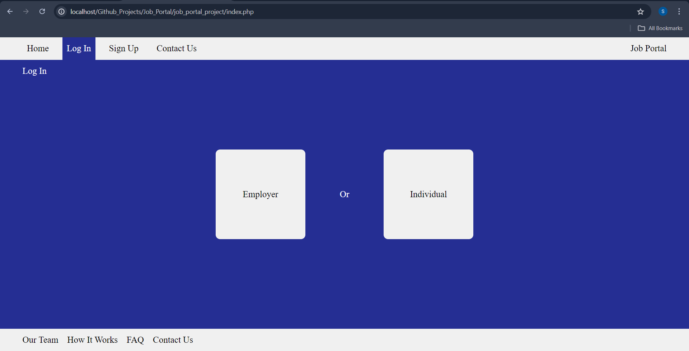
*Home Page: The landing page of the Job Portal Project, allowing users to choose their role.*

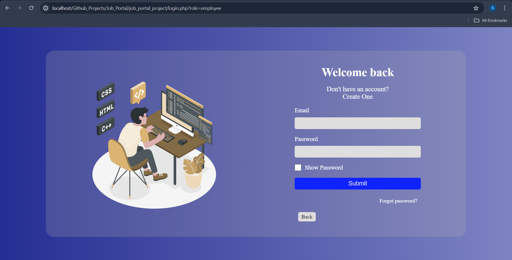
*Login Page: The page where users can log in using their credentials.*

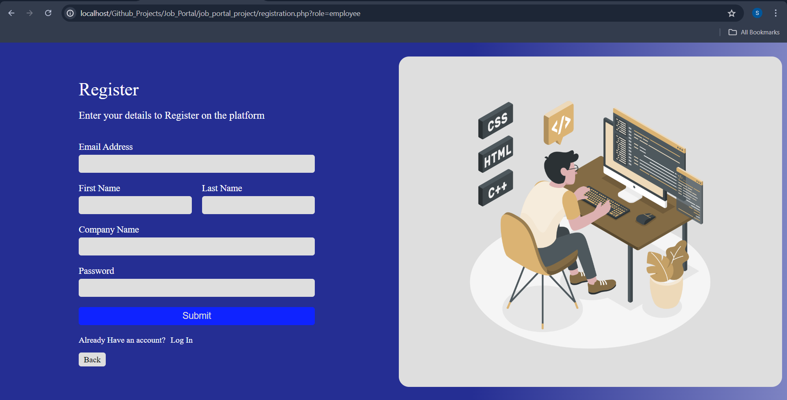
*Registration Page: The page where new users can register.*

**Candidate Role**

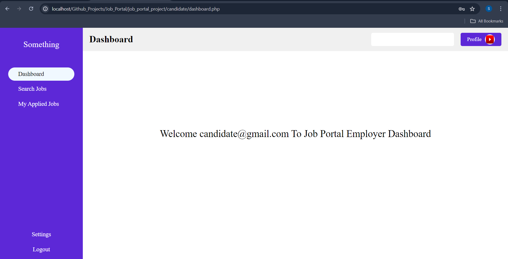
*Candidate Dashboard Page: The main dashboard for candidates, displaying their job application status and updates.*

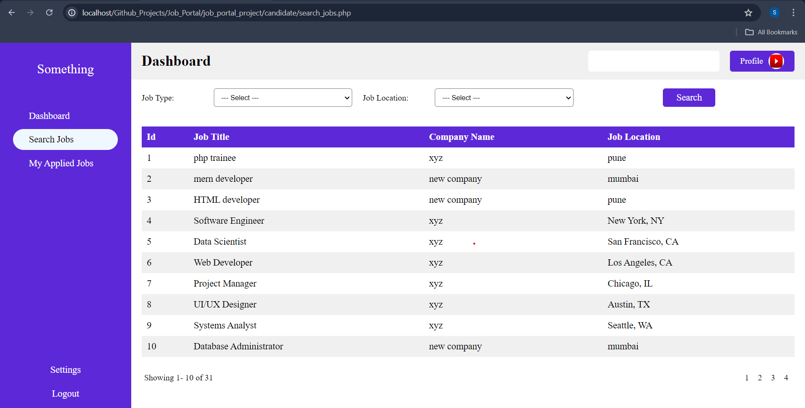
*Candidate Search Jobs Page: The page where candidates can search for available job listings.*

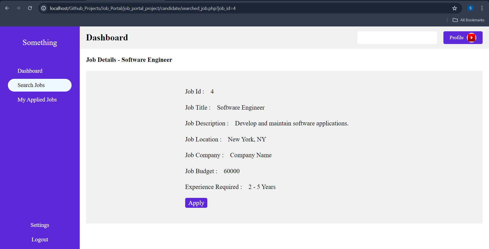
*Candidate Selected Job Page: The page displaying detailed information about a selected job.*

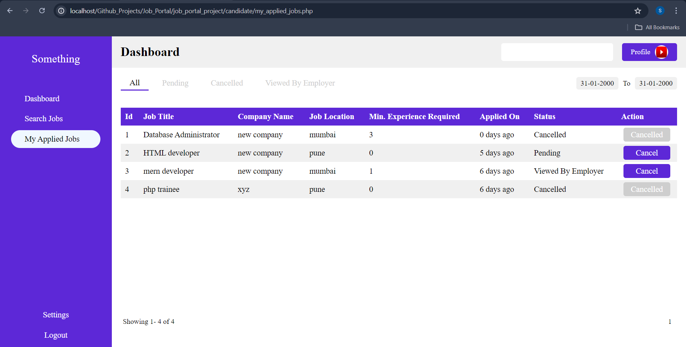
*Candidate Applied Jobs Page: The page where candidates can view the jobs they have applied for.*

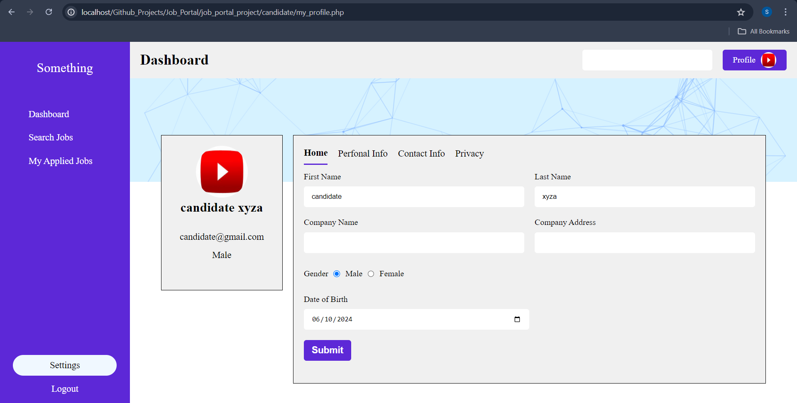
*Candidate Profile Settings Page: The page where candidates can manage and update their profile settings.*

**Employer Role**

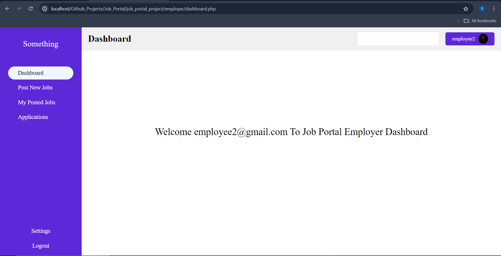
*Employer Dashboard Page: The main dashboard for employers, providing an overview of job postings and applications.*

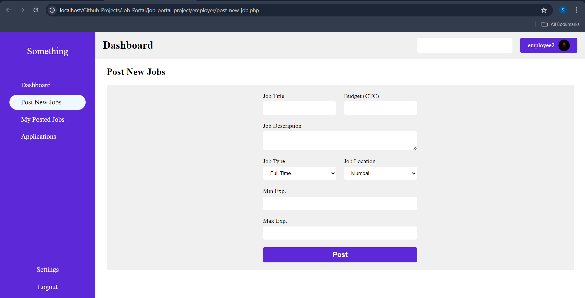
*Employer Post New Job Page: The page where employers can create and post new job listings.*

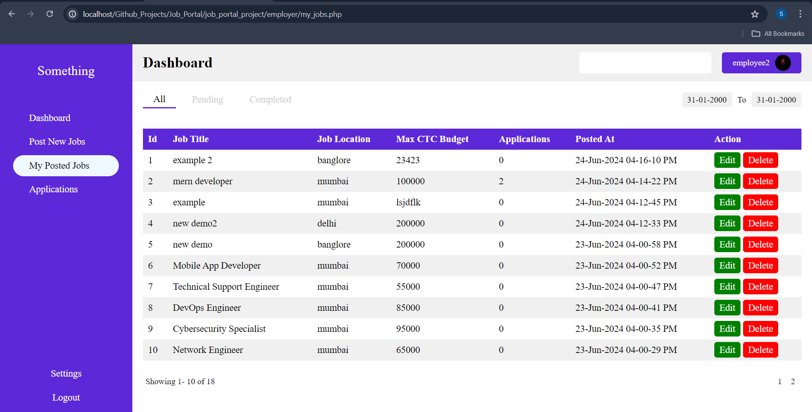
*Employer Posted Jobs Page: The page displaying all the jobs posted by the employer.*

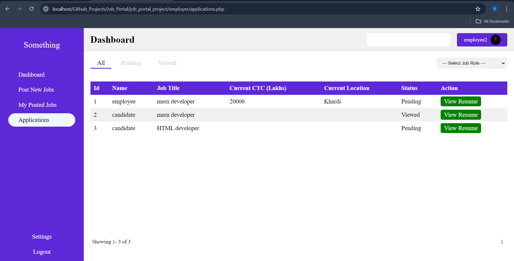
*Employer Applications Page: The page where employers can review and manage applications for their job postings.*

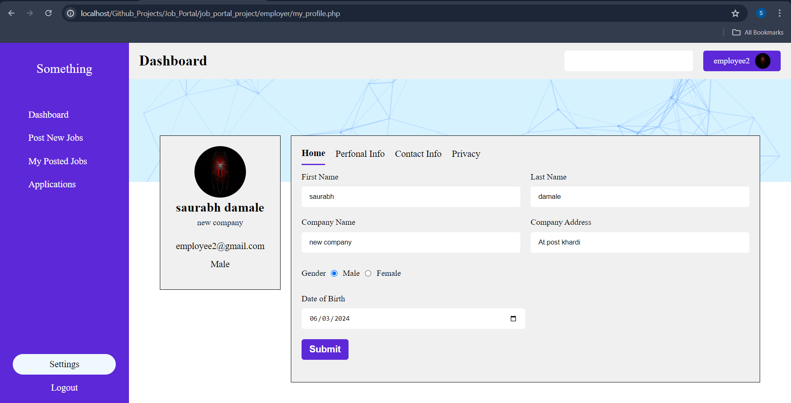
*Employer Profile Settings Page: The page where employers can manage and update their profile settings.*


## Contributing

If you'd like to contribute to the project, feel free to fork the repository, make changes, and submit a pull request. Your feedback, suggestions, and contributions are highly appreciated and will help improve the platform further.
